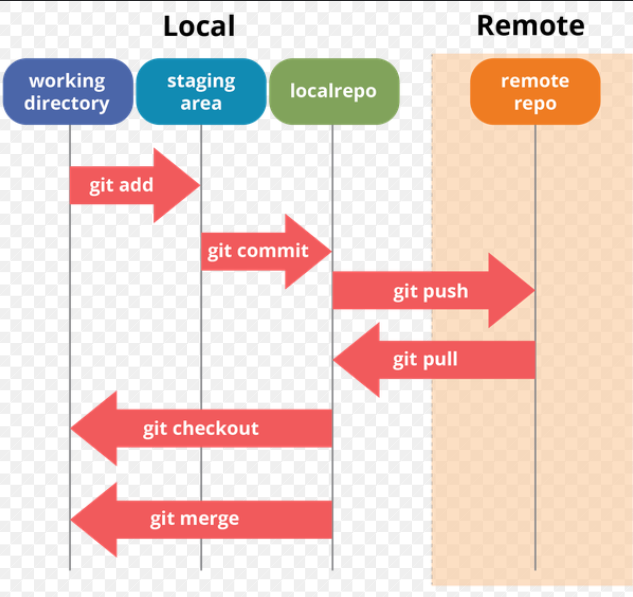

- Working Directory (Working Area):

  - This is the local folder on your computer where you edit and create files.
  - Changes you make here are not yet tracked by Git until you add them to the staging area.

- Staging Area (Index):

  - This is a temporary area where you prepare changes before committing them.
  - When you run git add, it moves changes from the working directory to the staging area.
  - This allows you to selectively choose which changes to include in the next commit.

- Repository (Local Repository):

  - This is where your committed changes are stored permanently.
  - When you run git commit, changes from the staging area are saved to the local repository, creating a new snapshot (commit) of your project’s history.

---

**This picture provides an example of the Git architecture**

  

