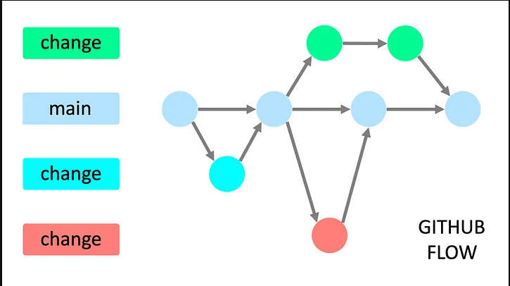
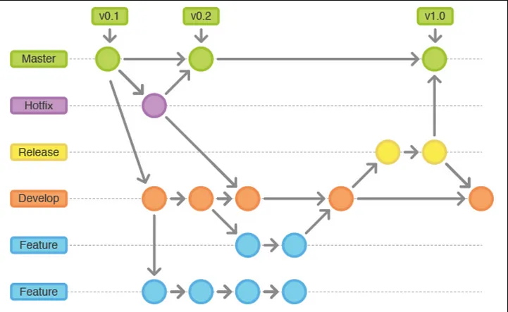
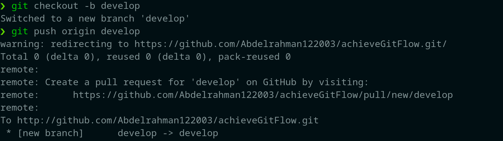
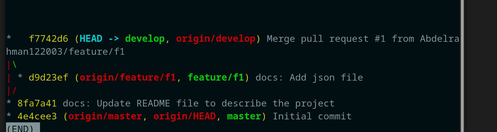

## The Perfect Commit

1. **Include the Right Changes**: Ensure that only relevant modifications are included in the commit.
2. **Craft a Clear Commit Message**: A well-structured commit message improves understanding.

**Structure of a Perfect Commit**

1. **Subject**: A concise summary of the changes made.

2. **Body**: A detailed explanation of the commit, covering:

   - **What has changed**: How is it different from the previous state?
   - **Reason for the change**: Why was the change necessary?
   - **Noteworthy details**: Is there anything important or unusual to be aware of?

## Types of Branches

- **Long-Running Branches**

  1. exist through the complete lifetime of the project.
  2. often, they mirror "stages" in your dev life cycle.
  3. common convention: no direct commits!

  Examples: main or master → Production Branch and develop.

- **Short-Lived Branches**

  1. for new features, bug fixes, refactorings, experiments
  2. will be deleted after integration(merge/rebase)

  Examples: feature, hotfix and release branches.

## Two Example Branching Strategies

1. GitHub Flow

   very simple, very lean: only one long-running branch("main") + feature branches.

   <p align="center">
     
   </p>

2. GitFlow

   - more structure, more rules
   - long-running: "main" + "develop"
   - short-lived: features, releases, hotfixes

   <p align="center">
     
   </p>

## Branches

- **`Main or Master → Production Branch`**
  The main or master branch is typically the default and primary branch in a Git repository. This branch represents the most stable version of the code and is often deployed to production. Changes to this branch should be carefully managed to ensure stability in the production environment.

- **`Release`** Branch (from develop): Used to prepare for a new production release. It allows for last-minute bug fixes or adjustments without interrupting ongoing development.

- **`Feature`** Branch (from develop): Created for developing new features or enhancements. Once the feature is complete, it's merged into the develop branch.

- **`Hotfix`** Branch (from main or master → production): Used to quickly address critical issues or bugs in the production version. After the fix, it's merged back into both the main and develop branches.

**_Follow a single naming convention without using multiple formats._**

## Pull Request

A pull request (PR) is a feature in Git-based version control systems where a developer proposes changes to a codebase. It allows team members to review the changes before they are merged into the main branch.

**Why Use a Pull Request:**

- **Code Review**: Ensures that changes are reviewed and approved by other team members, promoting better code quality.

- **Collaboration**: Facilitates discussion and feedback on the proposed changes.

- **Version Control**: Helps track changes and keep the main branch stable by preventing direct merges without approval.

## Steps to achieve the Gitflow:

1. Rename main branch to master from the UI.(optional)
2. Create and switch to the develop branch:

   ```s
   // Create the develop branch and switch to it
   git checkout -b develop

   // Push the develop branch to the remote repository
   git push origin develop

   ```

   <p align="center">
     
   </p>

3. Set develop as the default branch.
4. Set up the project in the develop branch.
5. Create the first feature branch:

   ```s
   git checkout -b feature/f1
   ```

6. During the feature development, you will make multiple commits. If you check GitHub, it will suggest creating a pull request from feature/f1 to develop. You can create the pull request once you complete the feature (the feature must be fully completed).

   <p align="center">
     
   </p>
